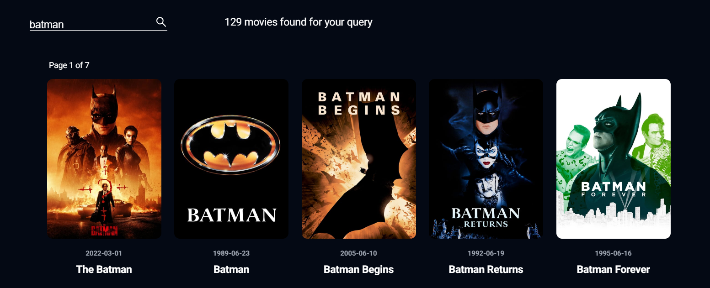

<h1 align="center">Movie Villa</h1>
<h2 align="center"><a  href="https://movie-villa.netlify.app/">Live Version</a></h2>

## Description

Movie Villa is implemented in React (Typescript). The data is received through <a href="https://www.themoviedb.org/">https://www.themoviedb.org</a>, this is the best api for movies that I found.


<p align="center"></p>

## What can be seen here

### Four categories of movies
   - Trending
   - Popular
   - Top Rated
   - Upcoming
   
<p align="center"></p>

### Search movies by title

<p align="center"></p>

### Movie details
   - Main info(title, poster, genres, release date, tagline, description, rating, prodaction companies)
   - Cast and crew
   - Movie trailer(Maybe there will be a movie later)
   - Rewiews and Posters
   - Similar movies

<p align="center"></p>

### Detailed information about the actor
   - Personal info
   - Biography
   - Films with his participation
   - Photos

<p align="center"></p>

## There is also a mobile version

<p align="center"></p>

## Project setup

```
npm install
npm start
```

